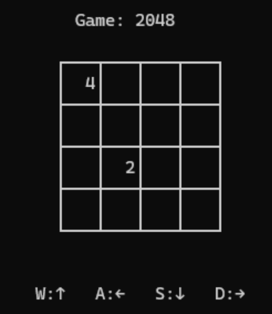

# 2048 遊戲 — C++ 終端機版本

以 C++ 實作的終端機 2048 益智遊戲，採用物件導向設計，將遊戲邏輯與畫面渲染分離為獨立的類別。

---

## 遊戲畫面
🔗 **[線上試玩 Demo](https://a23e0eb4-8554-4c6e-8739-c854489a2b8f-00-2von56k16dv7c.pike.replit.dev/)**


---

## 功能特色

- 4×4 棋盤
- 每次移動後隨機生成新數字（2 或 4）
- 自動判定勝利（達到 2048）與結束（無法移動）
- 支援鍵盤操作：`W A S D`

---

## 程式架構

本專案採用物件導向設計，將不同職責清楚分離：

| 類別 | 負責內容 |
|------|---------|
| `Game2048` | 核心遊戲邏輯 — 棋盤狀態、移動處理、合併規則、勝負判定 |
| `Display` | 畫面渲染 — 終端機顯示與遊戲主迴圈控制 |

```
main.cpp
  └── Display（負責畫面渲染）
        └── Game2048（負責遊戲狀態）
```

### UML 類別圖


---

## 如何執行


### 環境需求

- g++ 編譯器（C++11 以上）
- Linux / macOS 終端機（Windows 請使用 MinGW）

### 編譯與執行

```bash
# Clone 專案
git clone https://github.com/youzhen0827/Game-2048.git
cd Game-2048

# 編譯
g++ main.cpp Game2048.cpp Diaplay.cpp -o 2048

# 執行
./2048
```

---

## 操作說明

| 按鍵 | 動作 |
|------|------|
| `W` | 向上移動 |
| `S` | 向下移動 |
| `A` | 向左移動 |
| `D` | 向右移動 |

- 相同數字的方塊碰在一起會**合併**
- 每次移動後會隨機出現一個新方塊
- 成功合出 **2048** 即獲勝
- 棋盤填滿且無法移動時遊戲結束

---

## 檔案結構

```
Game-2048/
├── main.cpp        # 程式進入點
├── Game2048.h      # 遊戲邏輯標頭檔
├── Game2048.cpp    # 遊戲邏輯實作
├── Display.h       # 畫面渲染標頭檔
├── Diaplay.cpp     # 畫面渲染實作
├── UML.jpg         # UML 類別圖
└── README.md
```

---

## 學習成果

- 運用物件導向原則將遊戲邏輯與渲染層分離
- 實作二維陣列的方塊移動與合併演算法
- 設計終端機環境下的遊戲主迴圈

